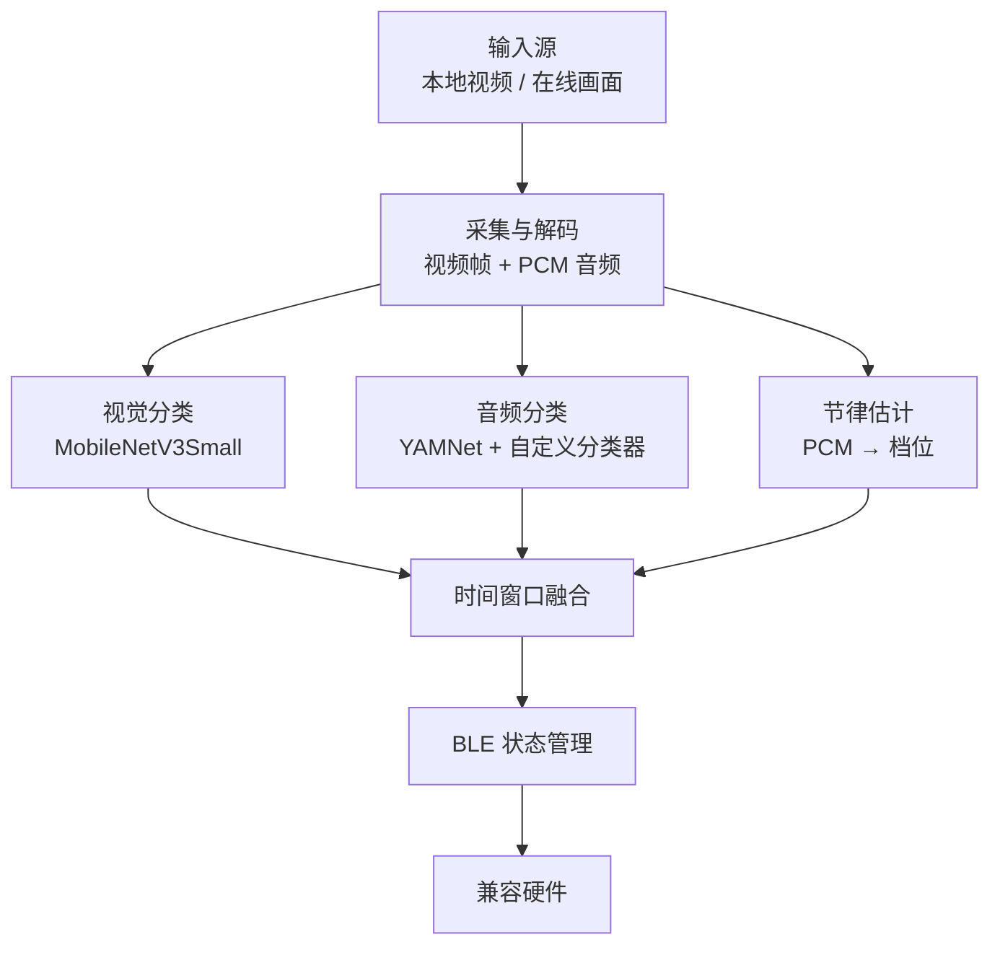

# Xcup iOS

一个运行在 iOS 端的实时视频理解与 BLE 联动项目。

Xcup iOS 会从本地视频或在线/直播画面中提取图像与音频，在设备端识别动作状态和节律强度，经过时间窗口平滑与状态管理后，将控制指令发送给兼容的 BLE 硬件。

本项目由 [Xcup Android](https://github.com/Tingfu-Zhou/xcup-android) 移植而来，保留了 Android 版的端侧推理、多模态融合、播放同步和 BLE 控制逻辑，并使用 AVFoundation、CoreBluetooth、Swift 与 GCD 等 Apple 平台技术重新实现。

> 本项目涉及成人内容识别场景，仅面向成年人。请在遵守当地法律、内容授权、隐私保护和第三方平台规则的前提下使用。

## 功能概览

- 本地视频分析：从系统照片或文件选择器载入视频，播放过程中同步分析画面与音频。
- 在线/直播分析：提供与 Android 在线模式对应的实时画面分析能力。
- 端侧视觉推理：使用 MobileNetV3Small TFLite 模型识别剧情、口部动作和性交动作三类画面。
- 端侧音频推理：使用 YAMNet 与自定义分类器识别动作类别。
- 节律强度估计：根据 PCM 音频生成离散强度档位，并与动作状态一同发送给硬件。
- 多模态融合：对近期音频与视频结果进行加权、过滤和时间窗口平滑，降低单次误判与状态抖动。
- BLE 控制：使用 CoreBluetooth 实现自动扫描、连接、协议帧构建、CRC 校验、状态解析和指令发送。
- 手动电子菜单：在 App 内直接选择变频模式（1-3）与马达强度（0-10 档），无需在设备上轮询实体按键。
- 本地按键优先：硬件按键可暂停 App 控制，用户可在主界面手动恢复。
- 播放同步：支持播放、暂停、Seek、播放结束恢复和横竖屏切换；Seek 后会重置历史状态并重新同步分析链路。
- 应用更新检查：通过远端版本配置判断推荐更新或强制更新，并跳转 App Store。

## 与 Android 版的关系

| 能力 | Android | iOS |
| --- | --- | --- |
| 本地视频分析 | 支持 | 支持 |
| 在线/直播分析 | 支持 | 支持 |
| 网页视频模式 | 支持 MP4/HLS | 当前不支持 |
| 端侧视觉推理 | TensorFlow Lite | TensorFlow Lite |
| 端侧音频推理 | YAMNet + 自定义分类器 | YAMNet + 自定义分类器 |
| BLE | Android BLE API | CoreBluetooth |
| 播放器 | VideoView/ExoPlayer | AVPlayer |

Android 版是本项目的上游实现参考。两端尽量保持模型输入、融合逻辑、动作映射和 BLE 行为一致，但受平台 API 与多媒体架构差异影响，部分实现并非逐行对应。

## 工作原理



系统主要由三个并行工作链路组成：

1. 视频链路按播放时间提取帧，维护 12 帧时序窗口，并周期性执行 MobileNetV3Small 推理。
2. 音频链路把音频统一处理为 16 kHz PCM，从环形缓冲区读取最近约 2 秒、共 32,000 个采样点的数据并执行 YAMNet 推理，同时估计节律强度。
3. 融合链路周期性读取最新结果，过滤过期数据，通过加权时间窗口生成最终动作与档位，再交给 BLE 状态管理器发送。

视频和音频推理运行在独立后台队列中；UI 更新、融合结果消费和用户交互由主线程协调。共享结果通过线程安全容器、`DispatchQueue` barrier 等机制管理，避免 PCM 缓冲与分析状态发生并发读写冲突。

## Android 到 iOS 的主要映射

| Android 实现 | iOS 实现 |
| --- | --- |
| `VideoProcessActivity.java` | `VideoProcessViewController.swift` |
| VideoView / ExoPlayer | AVPlayer |
| MediaExtractor + MediaCodec | AVAssetReader + AVAssetReaderTrackOutput |
| SurfaceTexture + OpenGL/EGL | AVAssetImageGenerator + CoreImage |
| Handler / Runnable | DispatchQueue、DispatchSourceTimer、CADisplayLink |
| `PcmCircularBuffer.java` | `PcmCircularBuffer.swift` |
| `AudioInferenceHelper.java` | `AudioInferenceHelper.swift` |
| Android BLE API | `BluetoothManager.swift` + CoreBluetooth |
| `synchronized` / 原子变量 | DispatchQueue barrier、同步读取和线程安全结果容器 |

## 核心组件

| 组件 | 作用 |
| --- | --- |
| `ContentView.swift` | 主界面、视频选择、BLE 状态、在线分析入口和导航 |
| `VideoProcessViewController.swift` | 视频播放、音视频分析、结果融合、UI 更新和 BLE 控制 |
| `VideoFrameExtractor.swift` | 使用 AVAssetImageGenerator 与 CoreImage 按时间提取视频帧 |
| `AudioDecoder.swift` | 使用 AVAssetReader 解码音频、限速、Seek 并写入 PCM 缓冲区 |
| `PcmCircularBuffer.swift` | 管理 PCM 环形缓冲、时间窗口读取和并发访问 |
| `AudioInferenceHelper.swift` | YAMNet 特征提取与自定义音频分类器推理 |
| `ThreadSafeAnalysisResults.swift` | 在线程之间安全保存和读取分析结果 |
| `ManualControlView.swift` | 手动电子菜单：模式选择、强度滑杆、紧急停止与下发节流 |
| `BluetoothManager.swift` | BLE 扫描、连接、协议帧编解码、CRC 校验和状态管理 |

## 模型规格

### 视频模型

- 骨干网络：MobileNetV3Small + Temporal Average Pooling + 三分类器
- 模型文件：`mobilenetv3small_tap_3class_float32.tflite`
- 输入：`[1, 12, 160, 160, 3]`，`float32`，NHWC，RGB
- 像素范围：`0-255`，模型内部包含 Rescaling，不应再次归一化
- 输出：`normal_plot`、`oral`、`sex` 三类 softmax 概率

### 音频模型

- 特征提取：预训练 YAMNet
- 分类器：面向当前任务微调的三分类模型
- 输入：2 秒、16 kHz、单声道 PCM，共 32,000 个 `Float` 采样点
- 输出：动作类别、置信度与时间戳
- iOS 注意事项：YAMNet 输入张量可能使用动态长度，复制 32,000 个采样点前应先将输入张量调整为正确形状，再分配张量内存

第三方预训练模型与相关资源仍受各自许可证和使用条款约束。自定义模型是否随仓库提供，请以 Xcode 工程中实际加入 App Target 的资源文件为准。

## 平台差异：网页视频模式

iOS 版当前不提供 Android 版的网页视频模式。

本地 MP4 和渐进式下载 MP4 可以通过 AVAssetReader 等公开 API 取得解码后的音频数据，满足 YAMNet 所需的 PCM 输入。对于 HLS 自适应码流，AVPlayer/CoreMedia 负责清单解析、码流选择、分片加载和解码；在本项目采用的公开 API 与播放架构下，无法像 Android ExoPlayer 一样，在完整 HLS 音频链路中稳定取得可供实时推理的 PCM 数据。

我们评估过 `MTAudioProcessingTap` 方案，但它不能为当前 HLS 多码率播放链路提供稳定、通用的 PCM 接入点。因此，为避免出现视频能够播放但音频分析不可用或结果不一致的情况，iOS 版暂不开放网页视频模式。

这属于当前实现与平台公开接口的边界，并不表示 iOS 在任何架构下都无法分析 HLS。若未来引入自定义 HLS 下载、解复用与解码链路，可重新评估该功能。

参考资料：

- [Apple HTTP Live Streaming](https://developer.apple.com/streaming/)
- [Apple MTAudioProcessingTap](https://developer.apple.com/documentation/mediatoolbox/mtaudioprocessingtap)
- [Android Media3 ExoPlayer](https://developer.android.com/media/media3/exoplayer)

## 开始使用

### 环境要求

- macOS 与项目所需版本的 Xcode
- 项目 Deployment Target 支持的 iOS/iPadOS 真机
- 有效的 Apple Developer 签名配置
- 支持 BLE 的 iPhone 或 iPad
- CocoaPods，以及项目所需的 TensorFlow Lite、ML Kit 等依赖
- 与目标硬件一致的 BLE 服务、特征 UUID 和协议帧格式

模拟器不适合完整验证 CoreBluetooth、实体设备控制、视频性能和真机生命周期行为，建议使用真机调试。

### 1. 获取代码

将本仓库克隆或下载到本地。

### 2. 安装依赖

如果仓库包含 `Podfile`，在项目目录执行：

```bash
pod install
```

完成后打开 `.xcworkspace`，不要直接打开 `.xcodeproj`。

### 3. 准备模型

确认视频模型、YAMNet 和自定义音频分类器已经加入 Xcode 工程，并勾选正确的 App Target。模型文件必须被复制到最终 App Bundle，且文件名应与代码中的加载路径一致。

### 4. 配置 BLE

在 `BluetoothManager.swift` 或对应配置文件中确认：

- 目标设备名称前缀
- Service UUID
- RX/TX Characteristic UUID
- 指令帧、CRC 与状态解析规则
- 动作和强度档位映射

仓库中的默认值未必适用于其他硬件。错误的协议、方向或档位映射可能导致设备行为异常，请先在低强度和空载状态下测试。

### 5. 配置权限与签名

在 Target 的 Signing & Capabilities 以及 `Info.plist` 中确认蓝牙、照片/文件访问及在线模式所需权限。蓝牙用途说明至少应与实际功能一致，例如：

```xml
<key>NSBluetoothAlwaysUsageDescription</key>
<string>本应用需要使用蓝牙连接和控制智能设备。</string>
```

请根据实际 Deployment Target 判断是否仍需兼容旧版蓝牙权限键，不要添加与功能无关的权限。

### 6. 构建与运行

1. 在 Xcode 中选择正确的 App Target。
2. 设置 Team、Bundle Identifier、Version 和 Build。
3. 连接 iPhone 或 iPad 真机。
4. 执行 Build & Run。

## 使用流程

### 本地视频

1. 在主界面连接 BLE 设备。
2. 从照片或文件选择器中选择视频。
3. 播放视频，应用会启动音视频分析与 BLE 联动。
4. 暂停、Seek 或退出播放时，应用会暂停分析并发送停止状态；恢复后重新同步。

### 在线/直播分析

1. 进入在线分析模式并完成系统要求的授权。
2. 启动需要分析的实时画面来源。
3. 应用持续执行画面、音频、融合和 BLE 控制链路。
4. 退出在线模式时停止分析并向硬件发送停止状态。

## 蓝牙协议

本项目通过 BLE 与 Xcup 硬件进行通信。关于第一批 Xcup 硬件使用的 BLE 通信协议、相关资料与参考实现，请参阅：

- [Xcup Bluetooth Protocol](https://github.com/Tingfu-Zhou/Xcup-Bluetooth-protocol)

不同硬件批次或固件版本使用的协议可能存在差异。进行硬件适配时，请以目标设备的实际固件和协议版本为准。

## 已知限制

- 当前不支持网页视频模式，尤其不提供 Android 版基于 ExoPlayer 的 HLS 网页分析链路。
- Photos 资源的导入行为可能涉及系统转码或临时文件准备，大体积视频的载入时间和内存占用取决于当前实现与设备状态。
- BLE 协议和档位映射与具体硬件绑定，不能直接保证兼容其他设备。
- 模型结果依赖训练数据分布，不应将分类输出视为对内容的绝对判断。
- iOS 后台执行、屏幕采集和音频处理能力受系统生命周期、权限和目标内容保护策略影响。

## 隐私与合规

- 音视频识别链路设计为端侧推理；如二次开发中加入日志上传、统计分析或云端推理，应明确告知用户并取得必要授权。
- 仅分析你有权访问和处理的内容，不得处理涉及未成年人、偷拍、胁迫或其他违法内容。
- 视频导入、屏幕采集和音频处理应遵守当地法律、内容版权、App Store 规则及目标服务的使用条款。
- 接入实体硬件前请增加强度上限、停止指令、连接异常处理和人工中止机制，并充分测试。

## 贡献

欢迎提交 Issue 和 Pull Request。提交改动时建议：

- 说明 Xcode、iOS/iPadOS、设备型号和复现步骤。
- 将模型调整、多媒体链路、BLE 协议和 UI 改动拆分为独立提交。
- 不要提交无权公开的视频、音频、训练数据、证书、Provisioning Profile、密钥或设备唯一标识。
- 对涉及线程、PCM 缓冲、Seek、暂停恢复或 BLE 状态机的改动补充真机测试结果。

## 相关项目

- [Xcup Android](https://github.com/Tingfu-Zhou/xcup-android)：本项目的 Android 上游实现
- [Xcup Bluetooth Protocol](https://github.com/Tingfu-Zhou/Xcup-Bluetooth-protocol)：第一批硬件使用的 BLE 协议资料与参考实现

## 许可证

本项目源代码采用 [Apache License 2.0](LICENSE) 开源。你可以在遵守许可证条款的前提下使用、修改和分发本项目代码，包括将其用于商业项目。

第三方依赖、预训练模型、自定义模型权重、训练数据及其他资源不一定适用 Apache License 2.0，应分别遵守其各自的许可证和使用条款。

Apache License 2.0 不授予对 Xcup 名称、商标、产品图片、Logo 或其他品牌资产的使用权。

## 致谢

- [AVFoundation](https://developer.apple.com/av-foundation/)
- [Core Bluetooth](https://developer.apple.com/documentation/corebluetooth)
- [LiteRT / TensorFlow Lite for iOS](https://ai.google.dev/edge/litert/ios/quickstart)
- [MobileNetV3Small](https://www.tensorflow.org/api_docs/python/tf/keras/applications/MobileNetV3Small)
- [YAMNet](https://www.tensorflow.org/hub/tutorials/yamnet)

---

如果这个项目对你有帮助，欢迎 Star、提交反馈，或分享你的改进方案。我的个人QQ:3247499719
